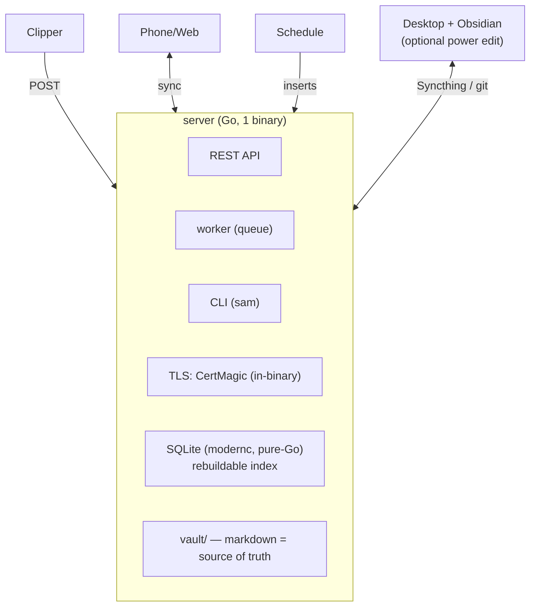
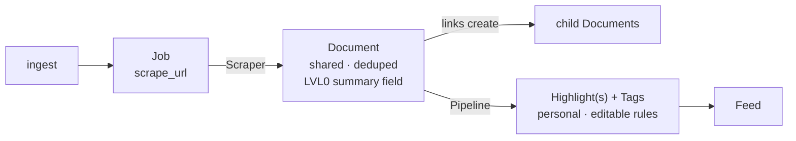

# Architecture Overview — Samizdat

Single-user, self-hosted, offline-first. **Server is the hub; devices pair in.** This file is the in-repo summary; the canonical research lives in the planning vault referenced in `CLAUDE.md`.

## 1. Topology

- **server/** runs the engine, the HTTP API, the cron worker, and embeds the web build. One static binary, no Docker, no nginx.
- **cli/** (`sam`) shares the engine; every command is headless. Runs locally on the server → local trust, no network auth.
- **app/** is the Expo client (iOS/Android/web). The web build is served by the server from `embed.FS`.
- **clipper/** is a paired API client (capture + manual add).

## 2. The two-phase pipeline (the core idea)

Separated by the **`Document`** seam:

- **Phase A — `Scraper` → `Document`:** fetch + extract (Defuddle/Trafilatura) + markdownify. **One `Document` per `canonical_url`** (dedup). Opinion-free, shareable, community-maintainable as config. A shared **LVL0 summary** is a *field on the Document*, computed once. Every link in a source becomes its own child `Document`.
- **Phase B — `Pipeline` → `Highlight`:** ordered `PipelineStep`s run *your* per-source prompt over the `Document` (+ `UserProfile`) → bite-sized `Highlight`s + `Tag`s. Personal, re-runnable, never re-fetches.

> Rule: the `Scraper` makes the `Document`; the `Pipeline` reads it.

## 3. Jobs & scheduling

- **Queue = a `jobs` table in SQLite** (no Redis). Kinds: `poll_feed`, `scrape_url`, `run_pipeline`, (later `transcribe`). Status `queued|running|done|failed|dead`.
- A worker goroutine claims jobs atomically (`BEGIN IMMEDIATE … RETURNING`), retries with backoff, meters tokens/cost per `Job`.
- **Cron just inserts jobs** on a `Schedule`; the CLI can insert any job. Same drain path.
- Jobs **produce** Documents/Highlights — nothing is created eagerly.

## 4. Storage

- **SQLite via `modernc.org/sqlite`** (pure-Go, CGO-free → single static binary). WAL mode.
- **The DB is a rebuildable index over `vault/`.** `sam reindex` reconstructs it from markdown. The vault (markdown + frontmatter UUIDs) is the source of truth.
- Portable SQL via `sqlc` so a future cloud step can target Postgres (driver + DSN swap, not a rewrite). pgvector/embeddings are deferred.
- One data dir = one backup: `config.toml` + `app.db` + `vault/`.

## 5. Sync (server-authoritative, change-cursor)

- Every row: `rev` (server monotonic seq) + `updated_at` + `origin` + `deleted_at` tombstone. **UUID PKs, client-minted.**
- **Pull:** phone sends `since_rev`; server returns rows with `rev > since_rev`.
- **Push:** phone sends changed *user-authored* rows; server applies **LWW**, assigns new `rev`.
- **Conflict surface is tiny** because rows split by writer: machine data (`Document`, `Highlight`) is **server→phone one-way**; only user-authored rows (`Annotation`, read-state, `Tag`) are two-way. `Note` md syncs via the vault. Broken replica → wipe + re-pull.

## 6. LLM providers (pluggable)

- One `Provider` interface, two adapters: **Anthropic native** (Messages API) + **OpenAI-compatible** (covers OpenAI cloud *and* local Ollama `:11434` / LM Studio `:1234` / llama.cpp `:8080`).
- Auto-detected on `sam init` (probe localhost) + a settings rescan.
- **Tiered routing:** triage/LVL0 → cheap/local or `claude-haiku-4-5`; breakdown → `claude-sonnet-4-6`; digest/draft → `claude-opus-4-8`. User maps tiers; all-local and all-cloud both valid.
- **Privacy rule:** credentialed/paywalled jobs route to a **local** provider, never cloud — enforced in the router.

## 7. Clients

- **app/ (Expo):** offline-first replica. Feed of `Highlight`s with per-filter resume, swipe-triage, gutter-anchored highlights in the Document viewer, one-tap LLM chat, digest assembly with auto-citation. Bottom tabs Feed · Digest · Settings + Add FAB + side drawers. (See `plan/005` in the vault.)
- **clipper/ (MV3):** extract client-side (Defuddle + Turndown), `POST /documents`, manual-add forms over the same API, offline IndexedDB queue. Site adapters = remote **config**, not code.

## 8. Security / reachability

- **Auth:** no accounts. Owner passphrase (Argon2id) → device tokens (Bearer, hashed SHA-256, revocable) → same-origin web cookie → CLI local trust.
- **TLS:** CertMagic in-binary (HTTP-01 / TLS-ALPN-01 / DNS-01). Domain or `sslip.io`.
- **Reachability:** VPS = public HTTPS, no VPN. Home/no-public-IP = Cloudflare Tunnel (no battery drain) > WireGuard > Tailscale. Off the happy path.

## 9. Build order

1. **L0′ (now):** newsletter + news-portal ingest → `Scraper`→`Document` → `Pipeline`→`Highlight` → Expo reader (feed + resume + links) → digest output.
2. Promote-gate → md vault, browser clipper for authed sources.
3. **Parked (forward-compatible):** podcast/YouTube transcripts (a transcript = a `Document` with time-anchored `Highlight`s), voice notes, visual `Pipeline` node editor, embeddings/semantic search, multiuser/billing.
