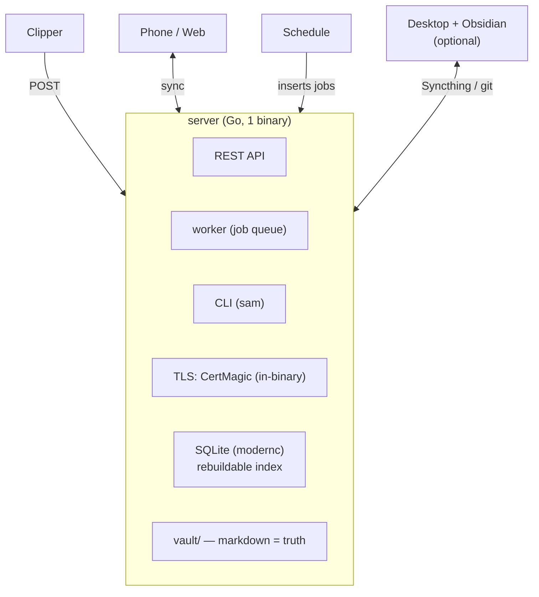
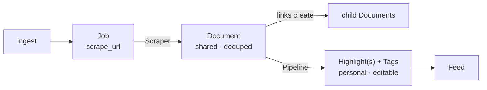

# Architecture — Samizdat

Single-user, self-hosted, offline-first. **Server is the hub; devices pair in.**
Why each choice, plus the bugs that shaped it: `docs/decisions.md`. Canonical research: the planning vault named in `CLAUDE.md`.

## 1. Topology

```mermaid
graph TD
    Clipper -->|POST| Server
    PhoneWeb["Phone / Web"] <-->|sync| Server
    Schedule -->|inserts jobs| Server
    Desktop["Desktop + Obsidian\n(optional)"] <-->|Syncthing / git| Server

    subgraph Server["server (Go, 1 binary)"]
        API[REST API]
        Worker["worker (job queue)"]
        SAMCLI["CLI (sam)"]
        TLS["TLS: CertMagic (in-binary)"]
        DB["SQLite (modernc)\nrebuildable index"]
        Vault["vault/ — markdown = truth"]
    end
```

- **server/** — engine + HTTP API + worker + scheduler; embeds the web build. One binary (cgo only for MuPDF).
- **cli/** — `sam`, headless, runs on the server box → local trust.
- **app/** — Expo client (Android/iOS/web); web build served from `embed.FS`.
- **clipper/** — MV3 capture client, paired like any device.

## 2. The two-phase pipeline (the core idea)

Separated by the **`Document`** seam:

```mermaid
flowchart LR
    Ingest[ingest] --> Job["Job\nscrape_url"]
    Job -->|Scraper| Doc["Document\nshared · deduped"]
    Doc -->|"links create"| ChildDoc["child Documents"]
    Doc -->|Pipeline| HL["Highlight(s) + Tags\npersonal · editable"]
    HL --> Feed
```

- **Phase A — `Scraper` → `Document`.** Fetch + extract + markdownify a URL **once** (dedup on `canonical_url`). Opinion-free, shareable. Every link in a source becomes its own child `Document`.
- **Phase B — `Pipeline` → `Highlight`.** Ordered `PipelineStep`s run *your* prompt over the `Document` (+ `UserProfile`) → bite-sized `Highlight`s + `Tag`s. Personal, re-runnable, never re-fetches.

> The `Scraper` makes the `Document`; the `Pipeline` reads it.

**Three `media_type`s, one Document shape:**

| type | fetch | body | extra |
|---|---|---|---|
| `article` | Playwright + Trafilatura | markdown | per-domain extractor config; optional login for paywalls |
| `pdf` | plain HTTP, pure-Go text | text + rendered figure crops (MuPDF) | never through the browser |
| `video` | `yt-dlp` (audio + subs) | flattened transcript prose | lang-keyed transcript, time-anchored annotations |

## 3. Jobs & scheduling

- **Queue = a `jobs` table.** Kinds: `poll_feed`, `scrape_url`, `run_pipeline`. Status `queued|running|paused|done|failed|dead`.
- Worker claims atomically (`BEGIN IMMEDIATE … RETURNING`), retries with backoff, meters tokens/cost per `Job`.
- The scheduler only **inserts jobs**; the CLI can insert any job. One drain path.
- Jobs **produce** Documents/Highlights — nothing is created eagerly.

## 4. Storage

- SQLite via `modernc.org/sqlite`, WAL. Queries via `sqlc` (portable SQL → a future Postgres swap is a driver change).
- **The DB is a rebuildable index over `vault/`.** `sam reindex` reconstructs it.
- One data dir = one backup: `config.toml` + `app.db` + `vault/`.

## 5. Sync (server-authoritative)

- Every row: `rev` (server monotonic) + `updated_at` + tombstone. **UUID PKs, client-minted.**
- **Pull:** client sends a cursor, server returns everything at/after it.
- **Push:** client sends changed *user-authored* rows; server applies LWW and assigns a new `rev`.
- **Small conflict surface:** machine data (`Document`, `Highlight`) is **server→phone one-way**; only user-authored rows (`Annotation`, read-state, `Tag`) are two-way. Broken replica → wipe + re-pull.
- Offline writes land in SQLite + an ordered **outbox**, replayed on reconnect.

## 6. LLM routing

- **One Router owns every endpoint** (`server/internal/llm`). Providers are discovered from `config.toml`, env keys, and the well-known local Ollama. A step names a **provider id + model** — never a URL, never a key.
- Two adapters: **Anthropic native** + **OpenAI-compatible** (covers OpenAI, OpenRouter, Ollama, LM Studio, llama.cpp).
- **Chain vs pin:** an empty provider walks primary → fallbacks (transport errors only). A named provider is **pinned and never falls back**.
- Tiers: triage → local or `claude-haiku-4-5`; breakdown → `claude-sonnet-4-6`; digest/draft → `claude-opus-4-8`.
- Long documents chunk by band (single call / partition / big-model) sized from the endpoint's real context.
- **Privacy rule:** credentialed/paywalled jobs route to a local provider, never cloud.
- Health is the outcome of the last *real* call (nothing probes on a render); `just check-llm` is the one active probe.

## 7. Clients

- **app/** — offline-first SQLite replica behind `src/db/`. Feed of `Highlight`s with swipe-triage, WebView document viewer with anchored annotations, video/podcast player on one shared timeline, vault-synced notes.
- **clipper/** — multi-instance "Save to Sam"; capture (Defuddle + Turndown) still to come. Site adapters are config, not code.

## 8. Security / reachability

- **Auth:** no accounts. Owner passphrase (Argon2id) → device tokens (Bearer, SHA-256 hashed, revocable) → CLI local trust.
- **TLS:** CertMagic in-binary. Domain or `sslip.io`.
- **Reachability:** VPS = public HTTPS. Home box = Cloudflare Tunnel > WireGuard > Tailscale.
- **Deploy:** prod is a per-instance user systemd service; `just dev` takes the port as a nohup and must hand it back with `just restart`.
