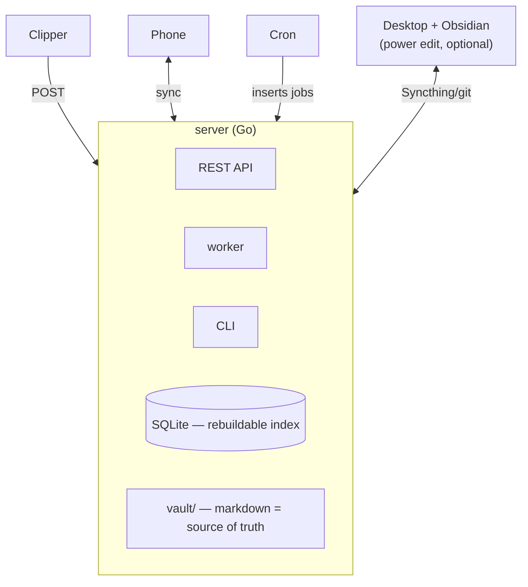

# Samizdat

**A self-hostable, AI-driven read → curate → cite → publish pipeline.** Turn a firehose of newsletters and news sources into bite-sized, source-tracked units you actually read — and turn what you read into your own published digest, without copy-pasting a single reference.

> *samizdat* — self-published, hand-passed, censorship-routing underground writing. The name is the thesis: own your sources, own your pipeline, own your output.

## Why

Reading is fragmented (you lose your place), and turning what you read into writing means endless manual copy-pasting of links, quotes, and citations. Samizdat collapses that loop:

- **Ingest** newsletters (email alias) + news portals (RSS) on your own server.
- **Break down** each source into bite-sized **units** using *your* editable rules per source.
- **Read** in a fast, offline, resumable app — not a note-taking tool bent into a reader.
- **Curate** with one swipe; **links are first-class** (every linked page is tracked, openable, citable).
- **Publish** your own newsletter-style digest with citations attached automatically.

Anti-slop, own-your-data, one-command self-host. OSS-first; a hosted convenience tier is optional and later.

## Shape

Single-user, self-hosted. **Server is the hub** (runs scrapers + cron, owns the canonical store and the markdown vault). **Devices pair in** (phone app, browser clipper, CLI).



## Components

| Folder | What | Stack |
|---|---|---|
| **`server/`** | REST API + cron worker + the engine (scrape, dedup, pipeline, store, sync) | Go, pure-Go SQLite, CertMagic TLS — single static binary |
| **`cli/`** | `sam` — every command headless (init, config, providers, pairing, jobs, digest) | Go |
| **`app/`** | The reader/curator client — iOS, Android, **and web** (one codebase) | Expo / React Native (+ RN Web, served by the server) |
| **`clipper/`** | Browser capture: clip pages, highlight, manual add — posts to the same API | Chrome/WebExtension (MV3) |

## Core model (names are load-bearing)

Two phases, separated by the **`Document`** seam:

- **Phase A — `Scraper` → `Document`** (shared, deduped, community-maintainable). Fetch + extract + markdownify a URL once. No opinion, no personalization.
- **Phase B — `Pipeline` → `Highlight`** (personal, your rules). Run your per-source prompt over a `Document` to emit bite-sized `Highlight`s + `Tag`s.

> *The `Scraper` makes the `Document`; the `Pipeline` reads it. Nothing in a Scraper is personal; nothing in a Pipeline re-fetches.*

Full glossary: `ARCHITECTURE.md` and the design docs (see `CLAUDE.md`).

## Status

Greenfield. Building **L0′** first: newsletter / news-portal ingest → unit breakdown → own reader → digest output. Podcast/transcript, voice notes, and the visual pipeline editor are parked (the data model stays forward-compatible).

## Commit Rules
Do not commit every little thing.
Wait for features to be ready.
If worktree is dirty, let the user know!

## Quick start

```sh
just            # list tasks
just setup      # install per-component deps (once each component is initialized)
just dev        # run the server in dev
just app        # run the Expo app
```

License: TBD (OSS-first; intent is permissive core).
