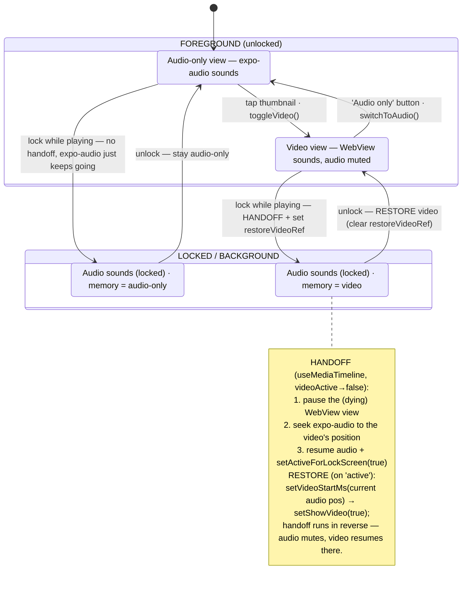
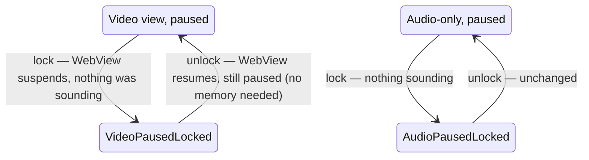
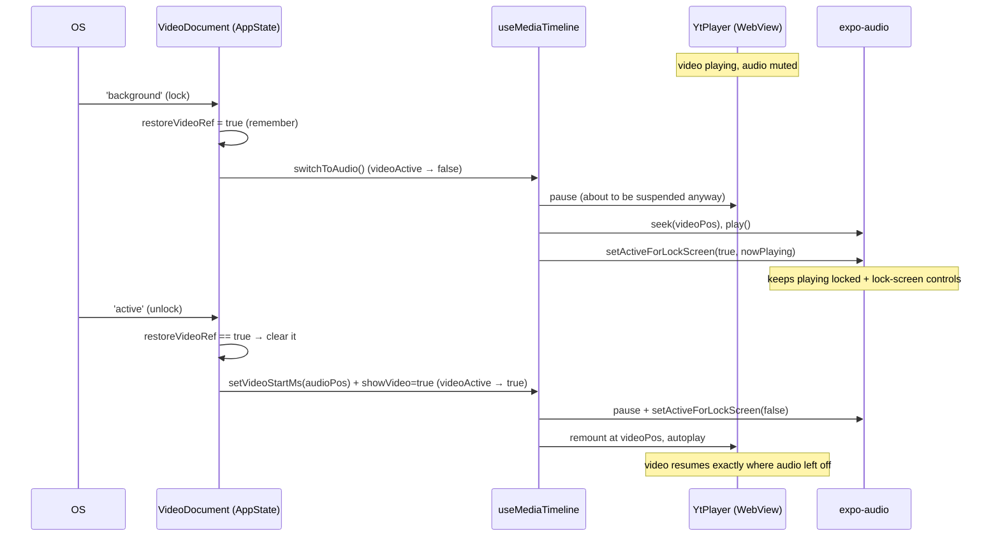

# Media playback — lock / unlock state machine

How a **video** `Document` keeps playing when the phone is locked, and how it
returns to exactly the state it was in on unlock.

Lives in `app/src/VideoDocument.tsx` (the `AppState` listener) + `app/src/useMediaTimeline.ts`
(the backend handoff). Version introduced: app `0.2.0`.

## The problem

The video backend is a **WebView** hosting the YouTube IFrame player
(`app/src/YtPlayer.tsx`). When the app goes to `background` (screen lock, app switch),
the OS **suspends the WebView** and its playback dies. Native audio does not have this
problem — `expo-audio` holds an OS media session and keeps playing when locked.

## Two backends, one timeline

`useMediaTimeline` exposes both behind one `AudioControl`; `videoActive` picks which one
sounds. They never sound at once (the handoff pauses one before starting the other).

| Backend | Impl | Survives lock? | Sounds when |
| --- | --- | --- | --- |
| **video** | YouTube WebView (`YtPlayer`) | ❌ suspended by OS | `videoActive` (video view open) |
| **audio** | `expo-audio` (`useAudio`) | ✅ via media session | audio-only view, or handed-off-to on lock |

## The memory

The only thing we must remember across a lock is **whether the video view was open and
sounding**. If so, we hand off to audio on lock and *restore the video view on unlock*.
Audio-only sessions need no memory — `expo-audio` already survives the lock untouched.

That memory is a single ref: `restoreVideoRef` in `VideoDocument.tsx`.

## State diagram

### Paused edge cases (no sound → no handoff, no memory)

Handoff only fires when something is **playing** at lock time.

## Round-trip sequence (video → lock → unlock)

## Invariants

1. **Never two sounds at once** — the handoff pauses one backend before starting the other.
2. **Position is continuous** across every transition (video pos → audio pos → video pos).
3. **Only the sounding backend owns the media session** — audio claims it on handoff/audio-only,
   releases it while the video WebView sounds (`setLockScreen(!videoActive && !!audioUrl, meta)`).
4. **Memory is one bit** (`restoreVideoRef`), set only on a video→lock-while-playing handoff and
   consumed on the next `'active'`. Audio-only and paused sessions carry no memory.
5. **Requires a Sam audio asset** — the handoff feeds expo-audio the offline-synced file or the
   `audioDocUrl` server stream, not the YT iframe. A doc with only a YT id and no server audio
   cannot hand off.

## Code pointers

- `app/src/VideoDocument.tsx` — `AppState` listener (the state machine), `restoreVideoRef`, `nowPlaying`.
- `app/src/useMediaTimeline.ts` — backend handoff effect + `setLockScreen` on transition.
- `app/src/useAudio.ts` — `setLockScreen()` → `player.setActiveForLockScreen(...)` (no-op on web).
- `app/app/_layout.tsx` — `setAudioModeAsync({ shouldPlayInBackground, interruptionMode: 'doNotMix' })`.
