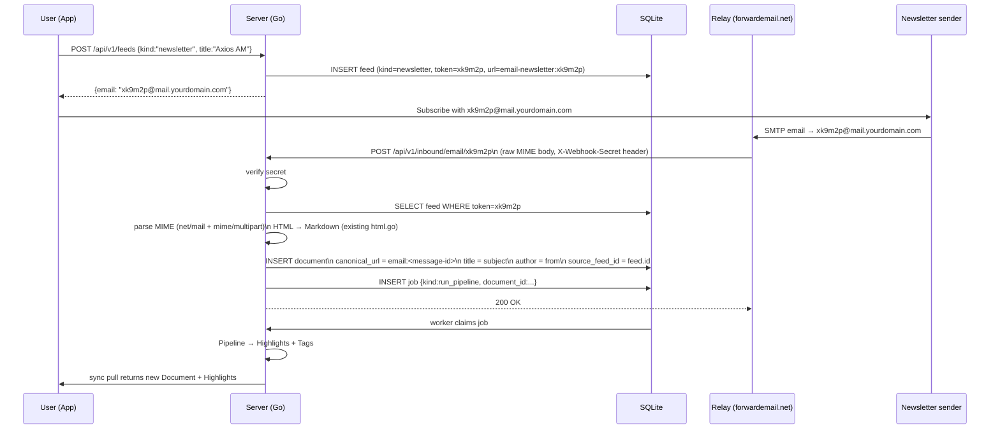
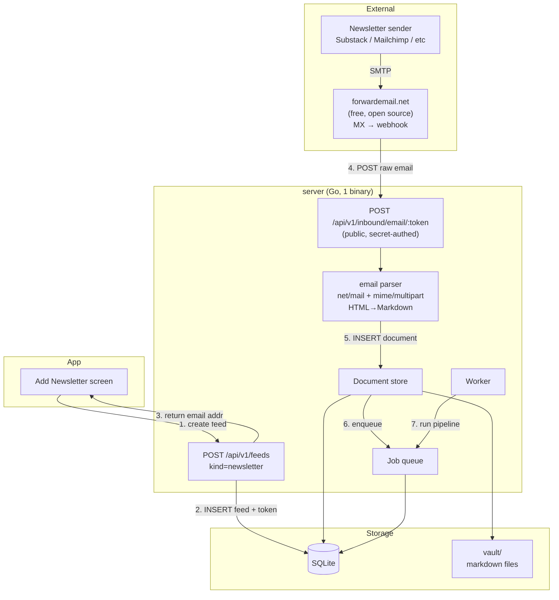

# Newsletter Ingest — kill-the-newsletter style

## Goal

User subscribes to a newsletter using a server-generated email address like
`xk9m2p@mail.yourdomain.com`. When the newsletter sends an email, a relay
(forwardemail.net) POSTs it to the server. Server creates a `Document` and
queues the pipeline. Zero OAuth, zero Google Console.

---

## Data Flow



---

## Architecture



---

## Schema changes

### `feeds` table — no new columns needed

Store token in existing `config` JSON field:
```json
{
  "token": "xk9m2p",
  "email": "xk9m2p@mail.yourdomain.com"
}
```

`url` field = `"email-newsletter:xk9m2p"` (synthetic, satisfies UNIQUE constraint).
`kind` = `"newsletter"` (new enum value, existing column).

### `server_settings` — one new key

`"newsletter_webhook_secret"` — shared secret validated on inbound webhook.
`"newsletter_email_domain"` — e.g. `mail.yourdomain.com`

---

## New server code

| File | What |
|------|------|
| `internal/api/newsletter.go` | `POST /api/v1/feeds` handler extension + `POST /api/v1/inbound/email/:token` |
| `internal/extractor/email.go` | MIME parser → `ParsedEmail{Subject, From, MessageID, TextHTML, TextPlain}` |
| `internal/store/queries.sql` | `GetFeedByToken`, `GetFeedsByKind` |

No new dependencies — `net/mail` and `mime/multipart` are stdlib.
Existing `internal/api/html.go` (HTML→Markdown) is reused for email body.

---

## Relay setup (Cloudflare Email Routing + Worker)

Domain: `newsletter.tmpx.space`

### DNS / Email Routing
1. Cloudflare dashboard → `tmpx.space` → Email Routing → enable
2. Add catch-all rule: `*@newsletter.tmpx.space` → **Email Worker**

### Worker (`email-to-sam`)
```javascript
export default {
  async email(message, env, ctx) {
    const token = message.to.split('@')[0]; // "xk9m2p" from "xk9m2p@newsletter.tmpx.space"
    const buf = await new Response(message.raw).arrayBuffer();
    const resp = await fetch(`${env.SAM_SERVER}/api/v1/inbound/email`, {
      method: 'POST',
      headers: {
        'Content-Type': 'message/rfc822',
        'X-Recipient-Token': token,
        'X-Webhook-Secret': env.WEBHOOK_SECRET,
      },
      body: buf,
    });
    if (!resp.ok) throw new Error(`sam returned ${resp.status}`);
  }
};
```

Worker env vars (Cloudflare secrets):
- `SAM_SERVER` = `https://sam.tmpx.space` (or Tailscale URL)
- `WEBHOOK_SECRET` = random 32-char hex, also stored in `server_settings`

---

## Token generation

```go
func generateEmailToken() string {
    b := make([]byte, 4)
    rand.Read(b)
    return hex.EncodeToString(b) // 8 hex chars, e.g. "a3f92c1d"
}
```

Collision probability negligible for single-user scale.

---

## Document canonical_url

```
email:<message-id-header-value>
```

Example: `email:<01933a2b.xk9m2p@substack.com>`

Deduplication: if same newsletter sends duplicate, Message-ID is stable → INSERT OR IGNORE.

---

## User flow (app)

1. Tap FAB → "Add Newsletter"
2. Enter newsletter name (optional) → tap "Get Email Address"
3. App shows: `Copy xk9m2p@mail.yourdomain.com`
4. User pastes into newsletter subscription form
5. First email arrives → Document appears in feed

---

## What's NOT in scope (yet)

- Unsubscribe flow (delete feed → token stops matching → 404 on webhook)
- Attachment handling (skip for now, text/HTML body only)
- Multiple email domains
- Newsletter auto-detection (detect if a URL is Substack → offer email OR RSS)

---

## Open questions before implementing

1. Do you have a domain to use for `mail.yourdomain.com`?
2. forwardemail.net or Cloudflare Email Routing as relay? (forwardemail = simpler webhook, CF = free but needs Worker code)
3. Token in `config` JSON vs new `email_token` column on `feeds`? (JSON = no migration, column = indexable)
