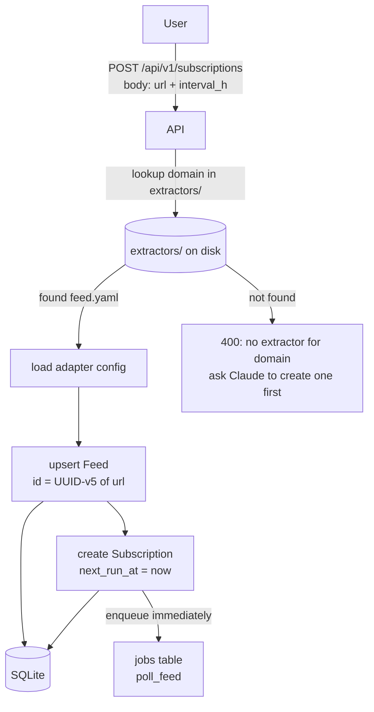
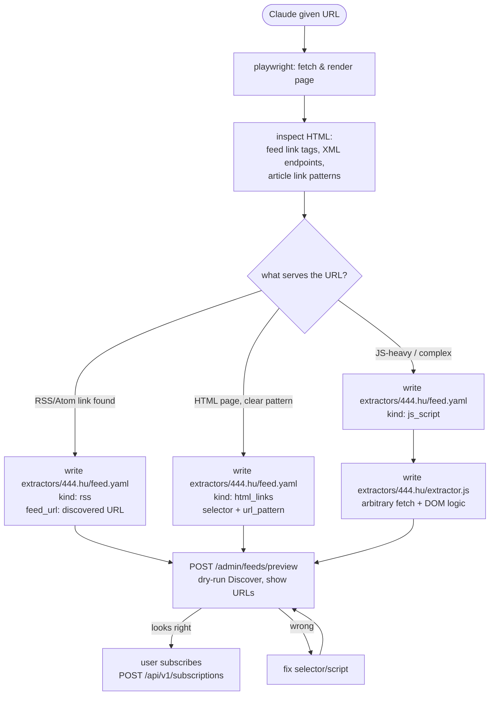
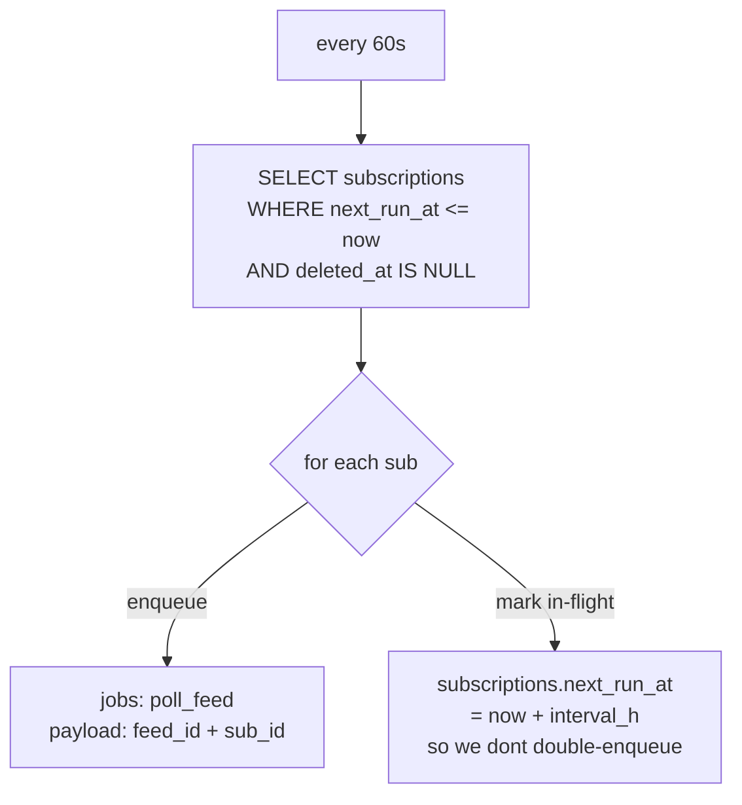
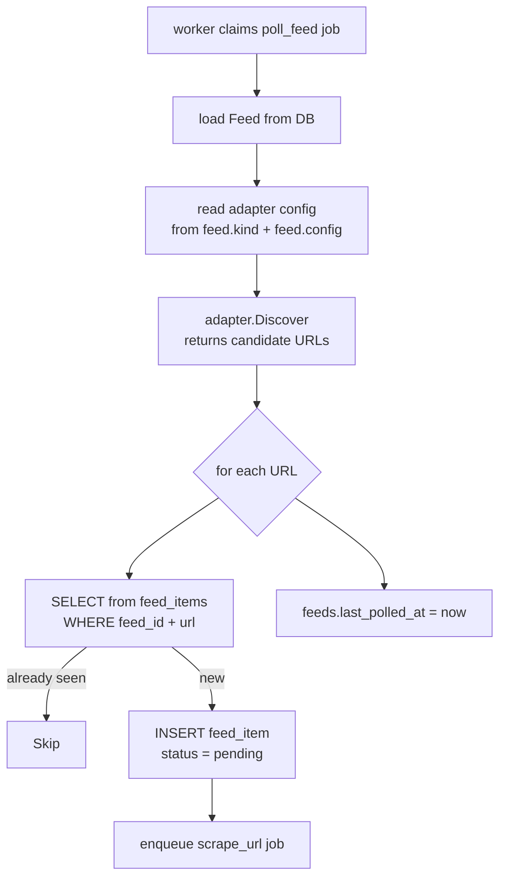
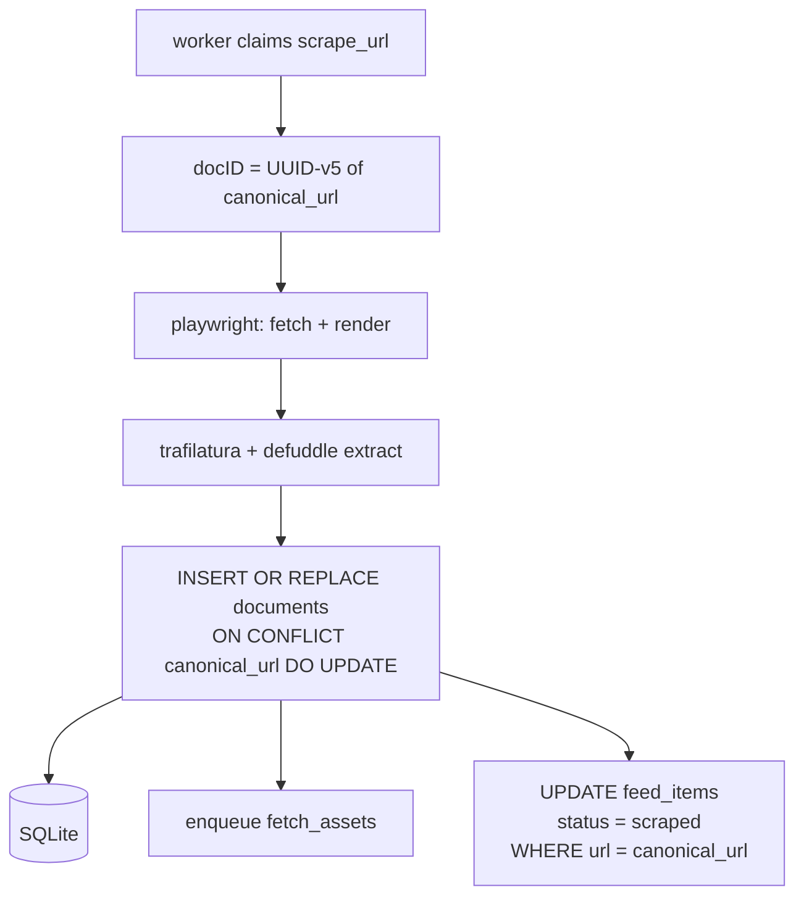
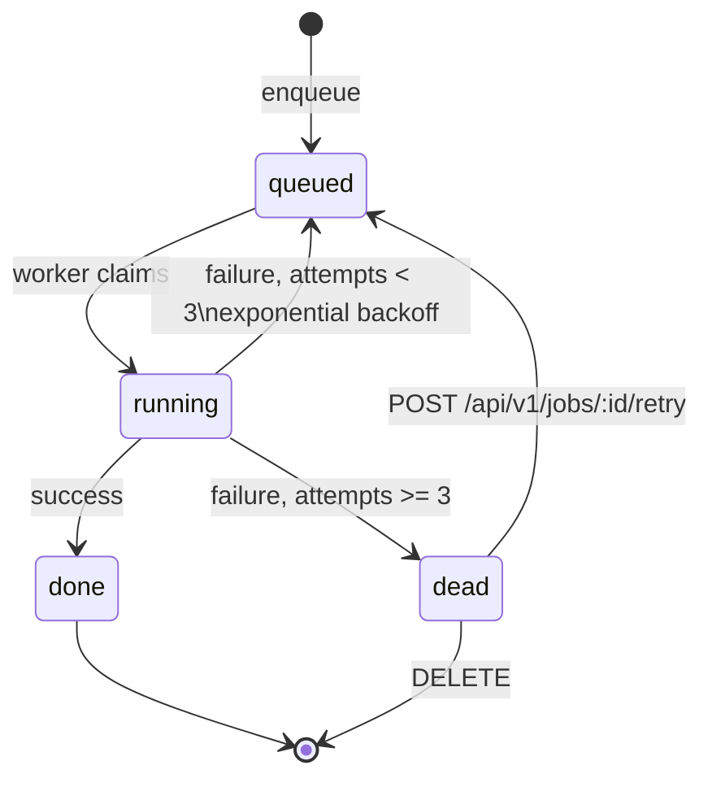

## Goal

Subscribe to any URL (author page, tag page, RSS feed, etc.), poll it on a schedule,
ingest new articles as `Document` records. Adapters are **written manually** (by the
user or Claude) before subscribing. No auto-detection at subscribe time — the system
only executes what an extractor config says.

---

## Graph 1 — Subscribe (one-time setup)



---

## Graph 2 — Write an extractor (manual / Claude-assisted)

User asks Claude: *"set up a feed for https://444.hu/author/bedem"*



---

## Graph 3 — Scheduler: enqueue due polls



Note: `next_run_at` is bumped here by the scheduler (not by the handler),
so a failed poll still reschedules rather than getting stuck.

---

## Graph 4 — poll_feed job: discover & diff



---

## Graph 5 — scrape_url: document upsert



---

## Graph 6 — Job state machine



---

## Extractor Filesystem

```
extractors/                   ← repo root, committed, version-controlled
  _template/
    feed.yaml.example
  444.hu/
    feed.yaml                 ← kind: html_links (no per-author RSS)
  bbc.com/
    feed.yaml                 ← kind: rss
  telex.hu/
    feed.yaml                 ← kind: html_links
  weird-js-site.com/
    feed.yaml                 ← kind: js_script
    extractor.js              ← Goja JS, no rebuild needed
```

### feed.yaml schema

```yaml
# kind: rss | atom | html_links | js_script

# --- html_links ---
kind: html_links
selector: "article.post h2 a"    # CSS selector
url_pattern: "/\\d{4}/\\d{2}/"   # regex filter on href
base_url: "https://444.hu"        # resolve relative hrefs
max_urls: 100

# --- rss / atom ---
# kind: rss
# feed_url: "https://example.com/feed.xml"  # may differ from subscription URL

# --- js_script ---
# kind: js_script
# (no extra fields — script path is always extractor.js in same dir)
```

### extractor.js (Goja sandbox, js_script kind)

Runs in a Goja VM with a small host API. Must return an array of URL strings.

```js
// available globals:
//   html      — rendered page HTML string (after Playwright load)
//   baseURL   — the feed URL
//   fetch(url) — simple HTTP GET, returns {status, body}
//   log(msg)  — writes to server log

const doc = parseHTML(html);  // built-in DOM-lite parser (via Go htmlquery)
const links = doc.querySelectorAll("div.content-list a.title");
return links
  .map(a => a.getAttribute("href"))
  .filter(h => /\/\d{4}\/\d{2}\//.test(h))
  .map(h => new URL(h, baseURL).href);
```

### Loading at startup

Server walks `extractors/*/feed.yaml` → builds `map[domain]ExtractorConfig`.
`js_script` kind also loads `extractor.js` bytes alongside.
No rebuild ever needed — YAML and JS are read from disk at startup (and hot-reloadable later).

---

## State Tracking: feed_items table

This is the dedup layer between "feed returned a URL" and "we scraped it".
Comparing against `documents` alone is wrong — it conflates "seen by feed" with "scraped".

```sql
CREATE TABLE IF NOT EXISTS feed_items (
    id          TEXT    PRIMARY KEY,  -- UUID-v5 of (feed_id || url)
    feed_id     TEXT    NOT NULL REFERENCES feeds(id),
    url         TEXT    NOT NULL,
    status      TEXT    NOT NULL DEFAULT 'pending',  -- pending | scraped | skipped
    seen_at     TEXT    NOT NULL,
    created_at  TEXT    NOT NULL,
    updated_at  TEXT    NOT NULL,
    rev         INTEGER NOT NULL DEFAULT 0,
    deleted_at  TEXT,
    UNIQUE(feed_id, url)
);
CREATE INDEX IF NOT EXISTS feed_items_feed_id ON feed_items(feed_id);
```

State transitions:
- `pending` → `scraped`: scrape_url job succeeds, handler updates row
- `pending` → `skipped`: user explicitly dismisses, or job dies with no retry
- `scraped` → `pending`: POST /retry on the related job (re-scrape)

---

## Schema Additions (full set)

```sql
CREATE TABLE IF NOT EXISTS feeds (
    id              TEXT    PRIMARY KEY,   -- UUID-v5 from url
    url             TEXT    NOT NULL UNIQUE,
    kind            TEXT    NOT NULL,      -- rss | atom | html_links | custom
    title           TEXT    NOT NULL DEFAULT '',
    config          TEXT    NOT NULL DEFAULT '{}',
    last_polled_at  TEXT,
    created_at      TEXT    NOT NULL,
    updated_at      TEXT    NOT NULL,
    rev             INTEGER NOT NULL DEFAULT 0,
    deleted_at      TEXT
);

CREATE TABLE IF NOT EXISTS subscriptions (
    id          TEXT    PRIMARY KEY,
    feed_id     TEXT    NOT NULL REFERENCES feeds(id),
    interval_h  INTEGER NOT NULL DEFAULT 24,
    next_run_at TEXT    NOT NULL,
    created_at  TEXT    NOT NULL,
    updated_at  TEXT    NOT NULL,
    rev         INTEGER NOT NULL DEFAULT 0,
    deleted_at  TEXT
);

CREATE TABLE IF NOT EXISTS feed_items (
    id          TEXT    PRIMARY KEY,
    feed_id     TEXT    NOT NULL REFERENCES feeds(id),
    url         TEXT    NOT NULL,
    status      TEXT    NOT NULL DEFAULT 'pending',
    seen_at     TEXT    NOT NULL,
    created_at  TEXT    NOT NULL,
    updated_at  TEXT    NOT NULL,
    rev         INTEGER NOT NULL DEFAULT 0,
    deleted_at  TEXT,
    UNIQUE(feed_id, url)
);
CREATE INDEX IF NOT EXISTS feed_items_feed_id ON feed_items(feed_id);

-- migrate existing jobs table
ALTER TABLE jobs ADD COLUMN last_error TEXT NOT NULL DEFAULT '';
```

---

## Deterministic UUIDs

```go
func IDFromURL(u string) string {
    return uuid.NewSHA1(uuid.NameSpaceURL, []byte(u)).String()
}
```

Apply everywhere: `documents`, `feeds`, `feed_items` (namespace `feed_id+url`).
`INSERT OR REPLACE` / `ON CONFLICT DO UPDATE` handles re-runs cleanly.

---

## API Surface

```
# Subscriptions
POST   /api/v1/subscriptions      {url, interval_h?}
GET    /api/v1/subscriptions
DELETE /api/v1/subscriptions/:id
PATCH  /api/v1/subscriptions/:id  {interval_h}

# Feed items (read-only, for UI)
GET    /api/v1/feeds/:id/items    ?status=pending|scraped|skipped

# Jobs
GET    /api/v1/jobs               ?status=&kind=&limit=&offset=
GET    /api/v1/jobs/:id
POST   /api/v1/jobs/:id/retry
DELETE /api/v1/jobs/:id

# Agent helper (admin)
POST   /api/v1/admin/feeds/preview   {url} → run adapter.Discover dry-run, return URLs found
```

---

## Claude Skill: `sam-feed-setup`

Location: `.claude/skills/sam-feed-setup.md` (committed, user-invocable via `/sam-feed-setup <url>`)

Steps:
1. Playwright-fetch + render target URL
2. Check for RSS/Atom `<link>` tags and common feed paths (`/feed`, `/rss`, `/atom.xml`)
3. If RSS found → write `extractors/<domain>/feed.yaml` (`kind: rss`, `feed_url: ...`)
4. Else → identify article link pattern (CSS selector + URL regex)
5. If pattern clear → write `feed.yaml` (`kind: html_links`)
6. If complex → write `feed.yaml` (`kind: js_script`) + scaffold `extractor.js`
7. `POST /api/v1/admin/feeds/preview {url}` → show discovered URLs to user
8. User confirms → `POST /api/v1/subscriptions {url, interval_h: 24}`

No auto-subscription. User always sees the URL list before committing.

---

## Implementation Order

1. `IDFromURL` helper → migrate `scraper.go`, `assets.go`
2. Schema: `feeds`, `subscriptions`, `feed_items`, `jobs.last_error`
3. `sqlc generate`
4. `extractors/` dir + YAML loader + adapter registry (no Go plugins, just map lookup)
5. `rss` adapter
6. `html_links` adapter (Playwright already wired)
7. `js_script` adapter (Goja VM, host API: html, baseURL, fetch, log)
8. `poll_feed` worker handler (Discover → diff feed_items → enqueue scrape_url)
9. Scheduler goroutine in Worker.Start
10. Subscription CRUD API
11. Jobs API (list/retry/delete)
12. `POST /admin/feeds/preview` dry-run endpoint
13. `sam-feed-setup` skill
14. App: Jobs screen + Subscriptions screen
15. e2e: `/sam-feed-setup https://444.hu/author/bedem` → confirm → verify documents
