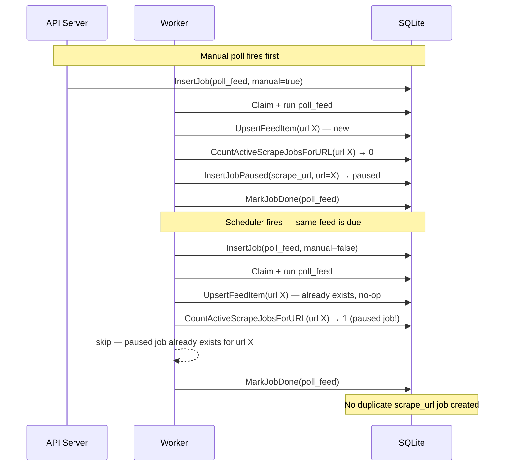
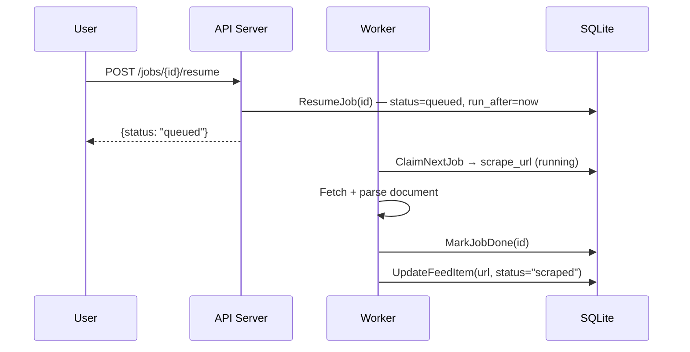
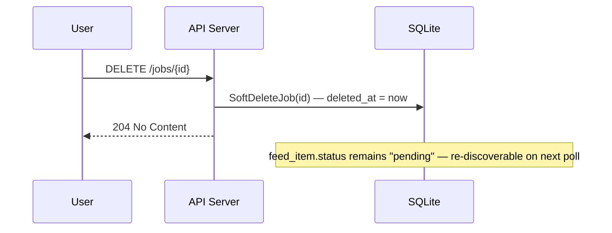

# Paused Jobs — Manual Poll Preview

## Current State Summary

### Job States (current)

The `jobs` table has a `status` column (TEXT, no DB-level enum) with these values in use:

| Status    | Meaning |
|-----------|---------|
| `queued`  | Ready to run; worker claims these via `ClaimNextJob` |
| `running` | Claimed and executing |
| `done`    | Completed successfully |
| `dead`    | Failed after `maxAttempts` (3) retries |

`InsertJob` always sets `status = 'queued'`. There is no `paused` state.

### Poll Flows (current)

**Subscription creation** (`POST /api/v1/subscriptions`): creates Feed + Subscription row, then inserts an immediate `poll_feed` job (queued). The `poll_feed` job runs `handlePollFeed`, which discovers URLs, upserts `feed_items`, and for each new item (status=`pending`, rev=0) inserts a `scrape_url` job (queued) as a child. Both auto-execute immediately.

**Manual "Poll Now"** (`POST /api/v1/subscriptions/{id}/poll`): inserts a `poll_feed` job (queued), which runs the same `handlePollFeed` path — same auto-scrape behaviour.

**Scheduled poll** (`schedulePollFeeds` in `worker.go`): runs every 60 s, finds subscriptions with `next_run_at <= now AND paused = 0`, inserts `poll_feed` jobs (queued). Same auto-scrape behaviour.

### Job UI (current)

`app/app/(drawer)/jobs.tsx` shows jobs in a grouped tree. Only `dead` jobs have a Retry button. No Resume or per-job Delete button exists in the UI. There is a bulk "clear" button (soft-deletes all done/dead/queued).

### Key Observation

`claimNextJob` only looks for `status = 'queued'`. A new `paused` status would be invisible to the worker loop without any code changes to the claim query — making it a safe addition.

---

## Proposed Changes

### 1. New Job Status: `paused`

Add `paused` as a valid status value. No DB schema migration needed — the column is already TEXT. The worker's `ClaimNextJob` query (`WHERE j2.status = 'queued'`) already ignores it.

Updated state machine:

```
paused ──resume──▶ queued ──claim──▶ running ──success──▶ done
                                           └──failure──▶ queued (retry backoff) or dead
paused ──delete──▶ (soft-deleted)
```

### 2. `InsertJobPaused` SQL Query (new)

Add a new sqlc query alongside `InsertJob`:

```sql
-- name: InsertJobPaused :one
INSERT INTO jobs (id, kind, payload, status, attempts, run_after, created_at, updated_at, rev, parent_job_id)
VALUES (?, ?, ?, 'paused', 0, ?, ?, ?, 0, ?)
RETURNING id, kind, payload, status, attempts, run_after, last_error, result, created_at, updated_at, rev, deleted_at, parent_job_id
```

`InsertJobPausedParams` mirrors `InsertJobParams`.

### 3. `ResumeJob` SQL Query (new)

```sql
-- name: ResumeJob :exec
UPDATE jobs SET status = 'queued', run_after = ?, updated_at = ?, rev = rev + 1 WHERE id = ?
```

### 4. `ClearCompletedJobs` — extend to include `paused`

Currently: `WHERE status IN ('done', 'dead', 'queued')`. Consider whether bulk-clear should also wipe paused jobs. **Recommendation: keep paused separate** — they represent a user-intentional hold. Extend the filter with an explicit `?include_paused` parameter, or leave bulk-clear alone and let the user use per-job delete.

### 5. Manual Poll Handler Changes (`server/internal/api/subscriptions.go`)

`poll()` currently calls `q.InsertJob(...)` for the parent `poll_feed`. The parent `poll_feed` job itself should still execute normally (we need it to discover URLs). Only the child `scrape_url` jobs it spawns should be paused.

Two design choices here:

**Option A (Payload flag — recommended):** Pass a `"manual": true` flag in the `poll_feed` payload. `handlePollFeed` reads this flag and calls `InsertJobPaused` instead of `InsertJob` for child `scrape_url` jobs.

**Option B (Separate handler):** Add a `"paused_children": true` flag to `InsertJob` call at the API level. The worker checks the parent job's payload when creating children.

**Decision: Option A.** It keeps the signal close to where child jobs are created and is self-documenting in the job tree.

Changes to `subscriptions.go` `poll()`:
```go
payload, _ := json.Marshal(map[string]string{
    "feed_id":  sub.FeedID,
    "feed_url": feedURL,
    "manual":   "true",   // new field
})
```

Changes to `worker/poll_feed.go` `handlePollFeed()`:
```go
type pollFeedPayload struct {
    FeedID  string `json:"feed_id"`
    FeedURL string `json:"feed_url,omitempty"`
    Manual  bool   `json:"manual,omitempty"`   // new
}

// When inserting scrape_url children:
if p.Manual {
    _, err = q.InsertJobPaused(ctx, store.InsertJobPausedParams{...})
} else {
    _, err = q.InsertJob(ctx, store.InsertJobParams{...})
}
```

**Subscription creation** (`create()` in `subscriptions.go`) currently also fires an immediate `poll_feed`. Decision: **keep it as normal (non-manual) poll** — first-subscribe should auto-scrape since the user just opted in. Only the explicit "Poll Now" button should pause.

### 6. New API Endpoint: `POST /api/v1/jobs/{id}/resume`

```go
// POST /api/v1/jobs/{id}/resume — set paused job back to queued.
func (h *jobsHandler) resume(w http.ResponseWriter, r *http.Request) {
    id := r.PathValue("id")
    now := time.Now().UTC().Format(time.RFC3339)
    if err := h.q.ResumeJob(r.Context(), store.ResumeJobParams{
        RunAfter:  now,
        UpdatedAt: now,
        ID:        id,
    }); err != nil {
        writeErr(w, http.StatusInternalServerError, "db error")
        return
    }
    writeJSON(w, http.StatusOK, map[string]string{"status": "queued"})
}
```

Register in `router.go`:
```go
mux.HandleFunc("POST /api/v1/jobs/{id}/resume", bearerAuth(q, jobsH.resume))
```

### 7. App UI Changes (`app/app/(drawer)/jobs.tsx`)

**Status filter bar:** Add `paused` to `STATUS_FILTERS`:
```ts
const STATUS_FILTERS = ['all', 'queued', 'paused', 'running', 'dead', 'done'] as const
```

**Status colour:**
```ts
paused: '#a78bfa',   // soft violet — distinct from queued yellow
```

**Job card:** Show Resume and Delete buttons for `paused` jobs:
```tsx
{job.status === 'paused' && (
  <>
    <Pressable style={s.resumeBtn} onPress={() => handleResume(job)}>
      <Text style={s.resumeBtnText}>Resume</Text>
    </Pressable>
    <Pressable style={s.deleteBtn} onPress={() => handleDelete(job)}>
      <Text style={s.deleteBtnText}>Delete</Text>
    </Pressable>
  </>
)}
```

**`handleResume(job)`**: calls new `resumeJob(activeUrl, token, job.id)` API helper → `POST /api/v1/jobs/{id}/resume`, then refetches.

**`handleDelete(job)`**: calls existing `softDelete` → `DELETE /api/v1/jobs/{id}`, then refetches. (No new API needed.)

**`ClearCompletedJobs`** currently deletes `queued` jobs too — see edge case below.

### 8. App API Client Changes (`app/src/api.ts`)

```ts
export async function resumeJob(serverUrl: string, token: string, id: string): Promise<void> {
    const res = await fetch(`${base(serverUrl)}/api/v1/jobs/${encodeURIComponent(id)}/resume`, {
        method: 'POST',
        headers: { Authorization: `Bearer ${token}` },
    })
    if (!res.ok) throw new ApiError(res.status, `resume job failed: HTTP ${res.status}`)
}

export async function deleteJob(serverUrl: string, token: string, id: string): Promise<void> {
    const res = await fetch(`${base(serverUrl)}/api/v1/jobs/${encodeURIComponent(id)}`, {
        method: 'DELETE',
        headers: { Authorization: `Bearer ${token}` },
    })
    if (!res.ok) throw new ApiError(res.status, `delete job failed: HTTP ${res.status}`)
}
```

---

## Duplicate Prevention Strategy

**Problem:** A paused `scrape_url` job exists for URL X (from a manual poll). The scheduler then auto-fires a `poll_feed` for the same feed. `handlePollFeed` sees the `feed_item` for X is already `status = 'pending'` and `rev = 0` → would insert *another* `scrape_url` job (this time queued, which would auto-execute).

**Current dedup gate in `poll_feed.go`:**
```go
if item.Status == "pending" && item.Rev == 0 {
    // enqueue scrape_url
}
```

The gate fires when the `feed_item` row has never been scraped (status=pending, rev=0). A paused job has nothing to do with the feed_item status — so both manual and automated polls would both try to enqueue.

**Proposed fix — check for existing live scrape_url job for the same URL:**

Add a new SQL query:
```sql
-- name: CountActiveScrapeJobsForURL :one
SELECT COUNT(*) FROM jobs
WHERE kind = 'scrape_url'
  AND json_extract(payload, '$.url') = ?
  AND status IN ('queued', 'running', 'paused')
  AND deleted_at IS NULL
```

In `handlePollFeed`, before inserting a child `scrape_url` job:
```go
count, _ := q.CountActiveScrapeJobsForURL(ctx, u)
if count > 0 {
    logPollFeed.Printf("skipping scrape_url for %s: active job already exists", u)
    continue
}
```

This applies to both manual and automated polls — preventing the auto-poll from creating a queued duplicate when a paused job already exists, and preventing re-queueing if the job is already running.

**Alternative considered:** Mark the `feed_item.status` as `paused_pending` when a paused job is created, and skip items not in `pending` state. Rejected — overloads the feed_item semantics and adds complexity to the reindex path.

---

## Timing Diagrams

### Manual Poll vs Automated Poll

```mermaid
sequenceDiagram
    participant U as User
    participant API as API Server
    participant W as Worker
    participant DB as SQLite

    rect rgb(40, 50, 80)
        note over U,DB: Manual Poll (Poll Now button)
        U->>API: POST /subscriptions/{id}/poll
        API->>DB: InsertJob(poll_feed, manual=true) → status=queued
        API-->>U: {job_id}
        W->>DB: ClaimNextJob → poll_feed job (running)
        W->>W: Discover URLs from feed
        W->>DB: UpsertFeedItem(url) — new item
        W->>DB: CountActiveScrapeJobsForURL(url) → 0
        W->>DB: InsertJobPaused(scrape_url, parent=poll_feed_id) → status=paused
        W->>DB: MarkJobDone(poll_feed)
        note over DB: scrape_url job sits paused — not picked up by worker
    end

    rect rgb(40, 70, 50)
        note over W,DB: Automated Scheduled Poll
        W->>DB: ListDueSubscriptions → sub due
        W->>DB: InsertJob(poll_feed, manual=false) → status=queued
        W->>DB: BumpSubscriptionNextRun
        W->>DB: ClaimNextJob → poll_feed job (running)
        W->>W: Discover URLs from feed
        W->>DB: UpsertFeedItem(url) — new item
        W->>DB: CountActiveScrapeJobsForURL(url) → 0
        W->>DB: InsertJob(scrape_url, parent=poll_feed_id) → status=queued
        W->>DB: MarkJobDone(poll_feed)
        W->>DB: ClaimNextJob → scrape_url job (running)
        W->>W: Fetch + parse document
        W->>DB: MarkJobDone(scrape_url)
    end
```



### Duplicate Prevention (Manual poll followed by auto-poll)



### Resume Flow



### Delete (Paused Job) Flow



---

## Open Questions / Edge Cases

### Q1: Resume-all button
Should the UI expose a "Resume All Paused" bulk action? Would call a new `POST /api/v1/jobs/resume-all` endpoint (or a `PATCH /api/v1/jobs?status=paused`). Deferred — do per-job first.
> YES, great idea

### Q2: Clear Completed — does it delete paused jobs?
`ClearCompletedJobs` currently targets `status IN ('done', 'dead', 'queued')`. It **does not** include `paused`. This is correct — paused jobs are user-held, not "completed". No change needed, but worth documenting explicitly.
> Yes, let's clear them all

### Q3: What happens when a paused scrape_url is deleted and the auto-poll then runs?
The `feed_item` row stays in `status = 'pending', rev = 0`. On the next auto-poll, `UpsertFeedItem` returns the existing row (upsert = update seen_at only). The gate `item.Status == "pending" && item.Rev == 0` would fire again. `CountActiveScrapeJobsForURL` would return 0 (deleted job is gone). So a new normal `scrape_url` job gets created and auto-runs. This is the correct behaviour.
> I guess if I deleted the job, that's fine.

### Q4: What if the user clicks "Poll Now" twice rapidly?
Two `poll_feed` jobs would be created. When the second one runs, `CountActiveScrapeJobsForURL` would see the paused jobs from the first poll and skip. No duplicates. However, the poll_feed parent jobs themselves might be duplicated. Consider adding a dedup check for active `poll_feed` jobs for the same feed_id in `poll()` — low priority.
> Add deduping per url job! 

### Q5: Paused jobs and the `resetStuckJobs` mechanism
`resetStuckJobs` resets jobs with `status = 'running'` older than 10 minutes back to `queued`. Paused jobs are not `running`, so they are unaffected. Safe.

### Q6: `clearCompletedJobs` wipes `queued` status — should it wipe `paused`?
Currently, `clearCompletedJobs` deletes `queued` jobs too (see `ClearCompletedJobsParams`). This is surprising behaviour for a "clear completed" button, but changing it is out of scope for this plan. Paused jobs are safe regardless.
> change it back. Add clear queue button separately.

### Q7: Should "Poll Now" on a paused subscription still pause child jobs?
Currently, subscriptions can be paused (`paused = 1`), which prevents automated scheduling. But the user can still hit "Poll Now" manually on a paused subscription. This plan proposes: **yes, manual poll always creates paused scrape_url children regardless of subscription pause state.** The subscription's `paused` field controls *scheduling*, not manual intent.
> let's create two separate buttons. One: Poll and process, the other poll but halt.

### Q8: Resume should only work on `paused` jobs — should we validate?
`ResumeJob` sets `status = 'queued'` unconditionally. If called on a `done` or `dead` job, it would re-queue it. Consider adding a guard: `WHERE id = ? AND status = 'paused'`. This is a minor safeguard but prevents accidental re-runs via direct API calls.
> yeah, do that.

---

## Files to Change (Implementation Checklist)

### Backend (Go)
- `server/internal/store/queries.sql` — add `InsertJobPaused`, `ResumeJob`, `CountActiveScrapeJobsForURL`
- `server/internal/store/queries.sql.go` — regenerate via `just server::gen`
- `server/internal/worker/poll_feed.go` — read `Manual` flag, call `InsertJobPaused` for children when true; add `CountActiveScrapeJobsForURL` dedup check for both paths
- `server/internal/api/jobs.go` — add `resume()` handler
- `server/internal/api/router.go` — register `POST /api/v1/jobs/{id}/resume`
- `server/internal/api/subscriptions.go` — add `"manual": true` to `poll()` payload

### Frontend (TypeScript/React Native)
- `app/src/api.ts` — add `resumeJob()`, `deleteJob()` functions; add `paused` to `Job` type status
- `app/app/(drawer)/jobs.tsx` — add `paused` to `STATUS_FILTERS` and `STATUS_COLOR`; add Resume + Delete buttons to paused job cards; add `handleResume()` and `handleDelete()` handlers
